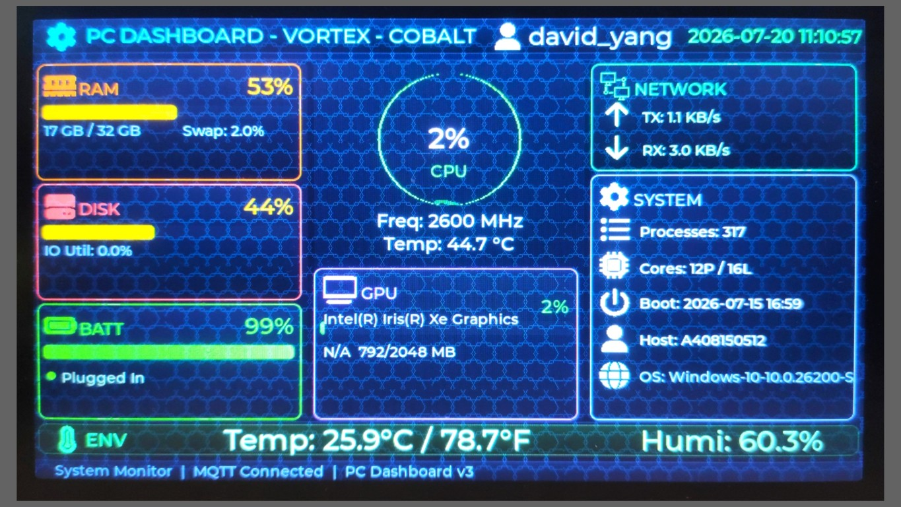

* [中文版](./README_CN.md)

---
<div align="center">

# PC Dashboard Monitor for Ameba RTL8721F (FreeRTOS)

</div>

[](https://freertos.org)
[](https://aiot.realmcu.com/en/latest/rtos/index.html)
[](https://github.com/Ameba-AIoT/ameba-rtos/releases)
[]()
[](LICENSE)
[](https://gitee.com/yangdavid988/mcu-pc-dashboard)
[](https://github.com/yangdavid988/mcu-pc-dashboard/search?l=c)
[](https://lvgl.io)
[](https://github.com/yangdavid988/mcu-pc-dashboard/actions/workflows/CI_build_check.yml)
[](https://github.com/yangdavid988/mcu-pc-dashboard)
[]()

🚀 A PC hardware resource monitor that subscribes to MQTT topics `pc/stats` (PC stats) and `humiture/measurement` (SHT3X sensor data) to receive real-time system status and environmental data. Parses JSON on the **Ameba RTL8721F** microcontroller and drives an **ST7262 TFT** (default, 800×480) or **DBL070 TFT** (opt-in) color screen via **LVGL 9.3** with a real-time dashboard.

The MCU acts as a pure subscriber — it only listens, never publishes.

- 📄 [Chip & module information](https://aiot.realmcu.com/cn/module/index.html)

---
<div align="center">



</div>

---

### ✨ Features

- ✅ **MQTT subscribe** — connects via TLS 8883, subscribes to `pc/stats` and `humiture/measurement`.
- ✅ **Dashboard on ST7262 (default) or DBL070 (opt-in) TFT** — 800×480, via LVGL 9.3 with dual-buffer + VBlank page flip (tear-free).
- ✅ **CPU / Memory / Disk** — color-coded progress bars with configurable threshold flash warnings.
- ✅ **GPU monitoring** — usage %, memory, temperature, and GPU model name.
- ✅ **Network** — upload/download speed (KB/s) with arrow icons.
- ✅ **CPU temperature** — when available from the PC-side collector.
- ✅ **CPU frequency** — current / min / max MHz.
- ✅ **Swap** — usage percentage, total and used bytes.
- ✅ **SHT3X temperature + humidity** — from MQTT topic, no local sensor needed.
- ✅ **Battery** — percentage + charging state indicator.
- ✅ **System info** — username, process count, physical/logical CPU cores, hostname, OS platform.
- ✅ **Clock** — boot time and current time (converted from Unix timestamp with UTC+8 offset).
- ✅ **Disk I/O** — total read/write bytes and I/O utilization percentage.
- ✅ **Wi-Fi auto-connect** with configurable retry.
- ✅ **MQTT TLS encrypted connection**.
- ✅ **3 dashboard layouts** — switch via GPIO button (circular: TRIAD → VORTEX → PULSE).
- ✅ **3 color themes** — switch via GPIO button (COBALT blue / INFERNO red / SILICON silver).
- ✅ **Fade transition animation** — smooth 200ms opacity crossfade on layout/theme switch.
- ✅ **Lock screen standby mode** — displays an analogue clock when the PC is locked (auto-detected), transitions back to monitor view on unlock.
- ✅ **PC event channel** — subscribes to `pc/event` for lock/unlock events published by the PC collector.
- ✅ **Configurable flash threshold system** — card borders and progress bars blink when values exceed warning levels.

---

### 🏗️ Project Structure

```
.
├── app_example/
│   ├── app_main.c              # Entry point, thread creation
│   ├── pc_dashboard.c/h   # MQTT client, JSON parsing, PC_Stats_t
│   ├── pc_dashboard_ui.c/h     # UI lifecycle, timer callbacks
│   ├── pc_dashboard_layout.c/h # V3 layout system (TRIAD/VORTEX/PULSE)
│   ├── pc_dashboard_theme.c/h  # Color themes (COBALT/INFERNO/SILICON)
│   ├── gpio_control.c/h        # GPIO button ISR → deferred switch
│   ├── WiFi_reconnect.c/h # Wi-Fi auto-connect
│   ├── threshold_config.h      # Warning flash thresholds
│   ├── sdk_compat.h            # SDK version compatibility
│   ├── lv_conf_project.h       # LVGL configuration override
│   ├── drv/lcd/                # LCD drivers (ST7262, DBL070, LCDC core)
│   ├── img_icons/              # 22 LVGL icon assets (C arrays)
│   ├── img_bg/                 # 3 theme background images
│   ├── scripts/                # PNG→LVGL conversion scripts
├── PC/                         # PC-side Python collector
├── env.sh                      # Linux/macOS environment setup
├── env.ps1                     # Windows PowerShell environment setup
├── env.bat                     # Windows cmd environment setup
├── CMakeLists.txt              # Top-level CMake
├── prj.conf                    # SDK Kconfig
└── Kconfig                     # SDK config reference
```
---

### 🧠 How It Works

1. On boot, the system initializes the ST7262 LCD, LVGL 9.3 UI, and Wi-Fi connection.
2. After Wi-Fi is connected, the MQTT client subscribes to topics `pc/stats` and `humiture/measurement`.
3. Two data sources publish to the broker:
   - **PC stats** — Python script collects hardware info via `psutil`, publishes to `pc/stats`.
   - **SHT3X sensor** — Another Ameba MCU reads temperature/humidity, publishes to `humiture/measurement`.
4. The dashboard MCU routes incoming JSON by topic, parses each, and updates the LVGL display in real time.
5. Physical GPIO buttons cycle through 3 layouts and 3 themes.

```text
Windows PC (psutil) ──MQTT──►  pc/stats              ┌──────────────────────────┐
                               MQTT Broker (TLS 8883) │  Ameba RTL8721F         │
SHT3X MCU ──────────MQTT──►  humiture/measurement    │  • Subscribe pc/stats    │
                                                     │  • Subscribe humiture/.. │
                                                     │  • Route by topic        │
                                                     │  • 3 layouts / 3 themes  │
                                                     │  • ST7262 800×480 TFT    │
                                                     └──────────────────────────┘
```

---

### 🔧 Hardware Setup

1️⃣ **Required Components**

- RTL8721F EVB (with Wi-Fi antenna + ST7262 RGB LCD module)
- MQTT Broker with TLS port 8883 (e.g. EMQX Cloud)
- Windows PC with Python 3.7+ (for stats collector)
- Another Ameba MCU with SHT3X sensor (optional, for temperature/humidity)

2️⃣ **LCD Options**

The project supports two LCD modules:

| Module | Resolution | Interface | Driver File | How to Enable |
|--------|-----------|-----------|-------------|---------------|
| **ST7262** (default) | 800×480 | RGB-565 parallel | `app_example/drv/lcd/st7262_cfg.c` | Default, no action needed |
| **DBL070** | 800×480 | RGB-565 parallel | `app_example/drv/lcd/dbl070_cfg.c` | Uncomment `add_definitions(-DUSE_DBL070)` in `app_example/CMakeLists.txt` |

Pin configurations are in `app_example/drv/lcd/st7262_cfg.c` and `dbl070_cfg.c`.

> The `-DUSE_DBL070` flag adjusts the framebuffer base address and LCDC timing parameters for the DBL070 module. Both drivers are compiled in; the flag selects which one is active at runtime.

3️⃣ **GPIO Button Mapping**

| Action | ST7262 Pin | DBL070 Pin |
|--------|-----------|------------|
| Cycle layout | PB_0 | PB_16 |
| Cycle theme | PA_31 | PB_14 |

Pull-up/down configured automatically. Interrupt-based with 250ms hardware debounce.

---

### 🚀 Getting Started

1️⃣ **Initialize SDK Environment**

```bash
# Edit env.sh to point to your ameba-rtos SDK root, then:
source env.sh
```

On Windows, use `env.ps1` which requires the SDK `env.bat` and the environment variable `AMEBA_ENV_PATH`:
```powershell
.\env.bat
```

⚡ **Requires SDK version release/v1.2**. LVGL 9.3 support is already included in this SDK version.

---

2️⃣ **Build the Example**

```bash
python ameba.py build
# or with aliases: bb, bp (parallel build)
```

---

3️⃣ **Configure MQTT Credentials**

Edit `app_example/pc_dashboard.h`:

```c
#define MQTT_BROKER_ADDRESS     "your-broker.emqxsl.cn"
#define MQTT_CLIENT_ID          "PC_DASHBOARD_MCU_1_COM19"  /* auto-selected by USE_DBL070 flag */
#define MQTT_USERNAME           "your-username"
#define MQTT_PASSWORD           "your-password"
```

Edit `app_example/WiFi_reconnect.h`:

```c
#define SSID                "your_wifi_ssid"
#define PASSWORD            "your_wifi_password"
```

---

4️⃣ **Configure Threshold Warnings**

Edit `app_example/threshold_config.h` to adjust when cards flash:

| Parameter | Default | Description |
|-----------|---------|-------------|
| `cpu_pct` | 70.0% | CPU usage flash threshold |
| `cpu_temp_c` | 60.0°C | CPU temperature threshold |
| `ram_pct` | 80.0% | RAM usage threshold |
| `disk_pct` | 90.0% | Disk usage threshold |
| `gpu_pct` | 80.0% | GPU usage threshold |
| `bat_low_pct` | 20.0% | Battery low threshold |
| `env_temp_c` | 35.0°C | Environmental temperature threshold |
| `flash_interval_ms` | 150ms | Flash blink interval |

---

5️⃣ **Run the PC Collector**

```bash
cd PC
pip install -r requirements.txt
python pc_to_emqx.py
```

Edit `PC/pc_to_emqx.py` to match the same MQTT broker settings(your id/password and broker ...).

Use `-d` or `--debug` flag to run in debug mode (prints JSON to stdout, no MQTT):
```bash
python pc_to_emqx.py --debug
```

---

6️⃣ **Flash & Monitor**

```bash
python ameba.py flash --p COMx \
  --image boot.bin 0x08000000 0x8014000 \
  --image app.bin 0x08014000 0x8200000

python ameba.py monitor --port COMx --b 1500000
```

---

### 🎨 Layouts & Themes

#### Layouts

| Layout | Description | Visual |
|--------|-------------|--------|
| **TRIAD** | 3-column matrix: CPU/RAM/DISK/BATT (left), GPU + DISK I/O (middle), NETWORK + SYSTEM (right) | Traditional desktop dashboard |
| **VORTEX** | CPU-centered: large CPU ring canvas with particle animation, RAM/DISK/BATT sidebar, GPU bar below ring | CPU-focused HUD |
| **PULSE** | 2×3 HUD grid: CPU/RAM/DISK in row 1, GPU/BATT/NET in row 2, full-width SYSTEM info bar | Compact heads-up display |

#### Themes

| Theme | Colors | Background |
|-------|--------|------------|
| **COBALT** | Intel blue accents | Tiled Intel logo watermark |
| **INFERNO** | AMD red accents | Tiled AMD logo watermark |
| **SILICON** | Apple silver/gray | Centered Apple logo watermark |

---

### 📝 Log Example

```text
=== PC Dashboard ===
FB base1=0x0C000000 base2=0x0C096000 driver=st7262
GPIO buttons initialized
LVGL UI ready, starting main loop...
Wi-Fi connected.
MQTT start
Connect Network "your-broker.emqxsl.cn"
Received PC stats (412 bytes)
PC stats updated: CPU=12.5%, MEM=62.3%, DISK=47.9%, NET=↑1.9/↓28.6 KB/s
Received SHT3X data (68 bytes)
SHT3X updated: 24.5 C, 48.2 %
```

> Actual log output may vary depending on the SDK version and runtime environment.

---

---

### 💻 PC Collector

A Python script (`PC/pc_to_emqx.py`) that collects local PC hardware statistics and publishes them to the MQTT broker.

#### Key Features

- **Hardware monitoring** — CPU, RAM, disk, GPU, network, battery, swap, disk I/O
- **Libre Hardware Monitor (LHM) integration** — on Windows, uses `pythonnet` to load `LibreHardwareMonitorLib.dll` for comprehensive sensor data (CPU Package/Core temps, fan speeds, voltages, power draw). Falls back to `nvidia-smi` / `wmic` if LHM is unavailable.
- **Lock screen detection** — detects Windows (LogonUI.exe) and Linux (dbus logind) lock events and publishes to `pc/event` topic so the MCU can enter standby/clock mode.
- **LHM GPU backfill** — fills GPU usage/memory/temperature for non-NVIDIA GPUs (Intel/AMD) from LHM sensor data.

#### Collected Metrics

| Metric | Data Source | MQTT Key |
|--------|-------------|----------|
| CPU usage (%) | `psutil.cpu_percent()` | `cpu` |
| CPU temperature (°C) | LHM / `psutil.sensors_temperatures()` | `cpu_temp` |
| CPU frequency (MHz) | `psutil.cpu_freq()` | `cpu_freq_*` |
| RAM usage/percent | `psutil.virtual_memory()` | `mem`, `mem_total`, `mem_used` |
| Disk usage/percent | `psutil.disk_usage()` | `disk` |
| GPU usage/memory/temp | LHM / `nvidia-smi` / `wmic` | `gpu_*` |
| Network speed | `psutil.net_io_counters()` (delta) | `net_*_kbps` |
| Disk I/O utilization | `psutil.disk_io_counters()` | `disk_io_percent` |
| Disk read/write | `psutil.disk_io_counters()` | `disk_read_bytes`, `disk_write_bytes` |
| Swap usage | `psutil.swap_memory()` | `swap_*` |
| Battery | `psutil.sensors_battery()` | `battery_*` |
| System info | `platform.*`, `socket.gethostname()` | `hostname`, `os_platform` |
| Lock screen event | Process/dbus check | `pc/event` (separate topic) |

#### Auto-Venv Feature

The script automatically runs inside a `.venv` virtual environment:

- On start, checks if already inside a venv; if not, re-executes via `.venv/Scripts/python` (Windows) or `.venv/bin/python` (Linux/macOS).
- To set up: `python -m venv .venv && pip install -r PC/requirements.txt`

#### Requirements

- Python 3.7+
- `psutil` — system stats collection
- `paho-mqtt` — MQTT publishing
- `pythonnet` (Windows) — LHM DLL integration
- `WMI` (Windows) — WMI-based GPU detection

Install: `pip install -r PC/requirements.txt`

#### GPU Support

GPU monitoring uses a three-tier fallback: `nvidia-smi` (NVIDIA) → WMI `Win32_VideoController` (Intel/AMD) → `wmic` CLI. LHM data is used to backfill usage/memory/temperature for non-NVIDIA GPUs. GPU failures are non-fatal — other metrics continue normally.

#### Libre Hardware Monitor (Windows)

For comprehensive sensor data (CPU Package temp, fan speeds, voltages, power), install [LibreHardwareMonitor](https://github.com/LibreHardwareMonitor/LibreHardwareMonitor) (portable, no installation needed). The script auto-detects the DLL from the default Downloads path or a running LHM process.

#### MQTT Topics

| Topic | Direction | Payload | Interval |
|-------|-----------|---------|----------|
| `pc/stats` | Publish | Flat JSON of all metrics | Every 3s |
| `pc/event` | Publish | `{"event": "lock"}` or `{"event": "unlock"}` | On lock state change (retained) |

The `pc/stats` topic publishes a flat JSON object. Example:

```json
{
  "pc/cpu/pct": 23.4,
  "pc/cpu/temp_c": 51.0,
  "pc/ram/used": 8492347392,
  "pc/ram/pct": 55.7,
  "pc/disk/pct": 42.1,
  "pc/net/sent_kbps": 1.2,
  "pc/net/recv_kbps": 35.8,
  "pc/gpu/name": "NVIDIA GeForce RTX 3060",
  "pc/gpu/pct": 15.0,
  "pc/bat/power_plugged": true,
  ...
}
```

The MCU parses these flat keys directly using `strstr()` — no external JSON library needed.

---

### 🔧 Configuration Reference

| File | Purpose |
|------|---------|
| `prj.conf` | SDK Kconfig (generated by `menuconfig.py -s prj.conf`). Enables LVGL 9.3, JPEG, DHCP. |
| `lv_conf_project.h` | LVGL override: 32-bit ARGB8888, 128KB heap, full Montserrat font family (8–48). |
| `threshold_config.h` | Flash warning thresholds for all monitored metrics. |
| `sdk_compat.h` | SDK version compatibility macros (`COMPAT_CHECK_CONNECTIVITY` / `COMPAT_REQUEST_IP`).

