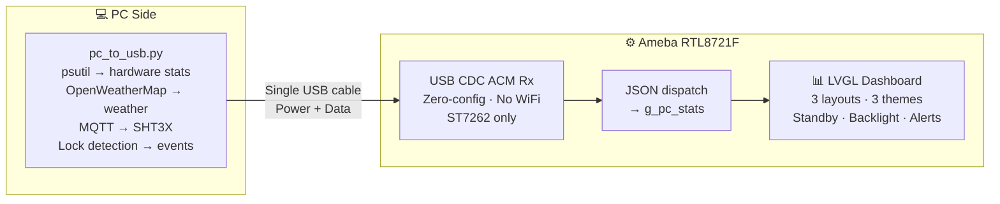
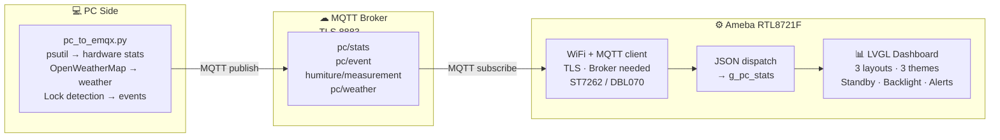

* [中文版](./README_CN.md)

---
<div align="center">

# PC Dashboard Monitor for Ameba RTL8721F (FreeRTOS)

</div>

[](https://freertos.org)
[](https://aiot.realmcu.com/en/latest/rtos/index.html)
[](https://github.com/Ameba-AIoT/ameba-rtos/releases)
[]()
[](LICENSE)
[](https://gitee.com/yangdavid988/mcu-pc-dashboard)
[](https://github.com/yangdavid988/mcu-pc-dashboard/search?l=c)
[](https://lvgl.io)
[](https://github.com/yangdavid988/mcu-pc-dashboard/actions/workflows/CI_build_check.yml)
[](https://github.com/yangdavid988/mcu-pc-dashboard)
[]()

🚀 A PC hardware resource monitor that receives real-time system status (CPU, GPU, RAM, disk, network) from a Windows PC via **USB CDC ACM virtual serial port** or **MQTT topics** (`pc/stats`, `pc/event`, `pc/weather`), plus environmental data via MQTT (`humiture/measurement`) and outdoor weather via HTTP. Parses JSON on the **Ameba RTL8721F** microcontroller and drives an **ST7262 TFT** (default, 800×480) or **DBL070 TFT** (opt-in) color screen via **LVGL 9.3** with a real-time dashboard.

Two mutually exclusive data paths, selected at compile time:
- **USB CDC mode** (`CONFIG_USB_CDC_MODE`) — **ST7262 only**. All data arrives via USB cable (CPU/RAM/DISK/GPU/NET/Battery and more). **No WiFi needed on MCU — zero configuration**. Optionally, the PC can forward SHT3X sensor data from MQTT.
- **MQTT mode** (no define) — DBL070 or ST7262 without USB. WiFi + MQTT for all data, weather via MCU HTTP.

- 📄 [Chip & module info](https://aiot.realmcu.com/en/home.html) | 🌿 [Gitee mirror](https://gitee.com/yangdavid988/mcu-pc-dashboard)

---
<div align="center">


</div>

---

### 🛠️ Tech Stack

<p>
  
  
  
  
  
  
  
  
</p>

### 🔍 Topics & Keywords

<p>
  <a href="https://github.com/topics/embedded"></a>
  <a href="https://github.com/topics/iot"></a>
  <a href="https://github.com/topics/freertos"></a>
  <a href="https://github.com/topics/lvgl"></a>
  <a href="https://github.com/topics/mqtt"></a>
  <a href="https://github.com/topics/realtek"></a>
  <a href="https://github.com/topics/dashboard"></a>
  <a href="https://github.com/topics/tft-display"></a>
  <a href="https://github.com/topics/pc-monitoring"></a>
</p>

---

### ✨ Features

- ✅ **USB CDC ACM** — primary data path on ST7262. All data arrives over USB cable (stats, weather, SHT3X forwarded by PC, lock events). No WiFi needed on MCU.
- ✅ **MQTT subscribe (fallback)** — for DBL070 or ST7262 without USB cable. Connects via TLS 8883, subscribes to `pc/stats`, `humiture/measurement`, `pc/event`, and `pc/weather`.
- ✅ **Dashboard on ST7262 (default) or DBL070 (opt-in) TFT** — 800×480, via LVGL 9.3 with dual-buffer + VBlank page flip (tear-free).
- ✅ **CPU / Memory / Disk** — color-coded progress bars with configurable threshold flash warnings.
- ✅ **GPU monitoring** — usage %, memory, temperature, and GPU model name.
- ✅ **Network** — upload/download speed (KB/s) with arrow icons.
- ✅ **CPU temperature / frequency** — current temperature, current/min/max MHz (when available from PC collector).
- ✅ **Swap** — usage percentage, total and used bytes.
- ✅ **SHT3X indoor temperature + humidity** — from MQTT topic, no local sensor needed.
- ✅ **Outdoor weather** — fetched every 10 min via HTTP from OpenWeatherMap (or pushed by PC via MQTT), showing city, temperature, humidity, and conditions.
- ✅ **Battery** — percentage + charging state indicator.
- ✅ **System info** — username, process count, physical/logical CPU cores, hostname, OS platform.
- ✅ **Clock** — boot time and current time (converted from Unix timestamp with UTC+8 offset).
- ✅ **Disk I/O** — total read/write bytes and I/O utilization percentage.
- ✅ **Wi-Fi auto-connect** with configurable retry and automatic reconnection on disconnect.
- ✅ **MQTT TLS encrypted connection**.
- ✅ **3 dashboard layouts** — switch via GPIO button (circular: TRIAD → VORTEX → PULSE).
- ✅ **3 color themes** — switch via GPIO button (COBALT blue / INFERNO red / SILICON silver).
- ✅ **Fade transition animation** — smooth 200ms opacity crossfade on layout/theme switch.
- ✅ **Standby mode** — analogue clock display when PC is locked, with sweep hand animation on time acquisition. Standby Manager orchestrates MQTT-to-LVGL task transition. Auto-dims backlight in standby.
- ✅ **PWM backlight control** — GPIO buttons for brightness adjustment (short press ±10%, long press jumps to min/max). OSD popup shows current percentage. Auto-dims to 20% in standby.
- ✅ **Configurable flash threshold system** — card borders and progress bars blink when values exceed warning levels. Thresholds configured in `threshold_config.h`.

---
### 📡 Dual-Mode Architecture: USB CDC vs. MQTT

| Aspect | MQTT Mode | USB CDC Mode |
|--------|-----------|--------------|
| **MCU connectivity** | WiFi required | **None** — USB cable only |
| **Cable** | Power USB + WiFi (wireless) | **Single USB: power + data** |
| **Setup** | SSID, password, broker TLS, certs | **Zero** — auto-detect serial port |
| **Power consumption** | Higher (WiFi radio active) | **Lower** (WiFi disabled) |
| **Firmware size** | Larger (~20–35 KB bigger) | **Smaller** (WiFi/MQTT excluded) |
| **Data collection** | Shared: MCU & PC | **All on PC** (psutil / weather / MQTT relay) |
| **Target screen** | ST7262 + DBL070 | **ST7262 only** (has USB pins) |

**USB CDC data flow (default):**


```mermaid
flowchart LR
    subgraph PC_USB["💻 PC Side"]
        HW_USB["pc_to_usb.py\npsutil → hardware stats\nOpenWeatherMap → weather\nMQTT → SHT3X\nLock detection → events"]
    end

    subgraph MCU_USB["⚙ Ameba RTL8721F"]
        USB_RX["USB CDC ACM Rx\nZero-config · No WiFi\nST7262 only"]
        JSON_USB["JSON dispatch\n→ g_pc_stats"]
        UI_USB["📊 LVGL Dashboard\n3 layouts · 3 themes\nStandby · Backlight · Alerts"]
    end

    HW_USB -->|Single USB cable\nPower + Data| USB_RX
    USB_RX --> JSON_USB
    JSON_USB --> UI_USB
```

**MQTT data flow (optional):**


```mermaid
flowchart LR
    subgraph PC_MQTT["💻 PC Side"]
        HW_MQTT["pc_to_emqx.py\npsutil → hardware stats\nOpenWeatherMap → weather\nLock detection → events"]
    end

    subgraph Broker["☁ MQTT Broker\nTLS 8883"]
        TOPICS["pc/stats\npc/event\nhumiture/measurement\npc/weather"]
    end

    subgraph MCU_MQTT["⚙ Ameba RTL8721F"]
        MQTT_RX["WiFi + MQTT client\nTLS · Broker needed\nST7262 / DBL070"]
        JSON_MQTT["JSON dispatch\n→ g_pc_stats"]
        UI_MQTT["📊 LVGL Dashboard\n3 layouts · 3 themes\nStandby · Backlight · Alerts"]
    end

    HW_MQTT -->|MQTT publish| TOPICS
    TOPICS -->|MQTT subscribe| MQTT_RX
    MQTT_RX --> JSON_MQTT
    JSON_MQTT --> UI_MQTT
```

### 🏗️ Project Structure

```
.
├── app_example/
│   ├── CMakeLists.txt          # Build configuration
│   ├── main/
│   │   └── app_main.c          # Entry point, thread creation
│   ├── core/                   # Core business logic
│   │   ├── pc_dashboard.c/h    # MQTT client, JSON parsing, PC_Stats_t
│   │   ├── standby_manager.c/h # Standby entry/exit orchestration
│   │   ├── weather.c/h         # Weather data (HTTP fetch or MQTT push)
│   │   ├── usb_cdc_receiver.c/h# USB CDC ACM receiver (PC stats via cable)
│   │   └── wifi_reconnect.c/h  # Wi-Fi auto-connect with retry
│   ├── ui/                     # UI presentation layer
│   │   ├── pc_dashboard_ui.c/h     # UI lifecycle, timer callbacks
│   │   ├── pc_dashboard_layout.c/h # V3 layout system (TRIAD/VORTEX/PULSE)
│   │   ├── pc_dashboard_theme.c/h  # Color themes (COBALT/INFERNO/SILICON)
│   │   └── pc_dashboard_lock_screen.c/h  # Lock screen clock
│   ├── hal/                    # Hardware abstraction layer
│   │   ├── backlight_ctrl.c/h  # PWM backlight control
│   │   ├── gpio_control.c/h    # GPIO button ISR → deferred switch
│   │   ├── lcd/                # LCD drivers (ST7262, DBL070, LCDC core)
│   │   └── usb/                # USB CDC ACM custom descriptor (PID override)
│   ├── config/                 # Configuration headers
│   │   ├── threshold_config.h  # Central config: thresholds, timeouts, brightness, retry
│   │   ├── lv_conf_project.h   # LVGL configuration override
│   │   ├── sdk_compat.h        # SDK version compatibility
│   │   └── suppress_mqtt_log.h # MQTT log suppression
│   ├── assets/                 # Image/icon resources
│   │   ├── icons/              # 22 LVGL icon assets (C arrays)
│   │   └── backgrounds/        # 3 theme background images + clock
│   └── scripts_tools/          # PNG→LVGL conversion scripts
├── PC/                         # PC-side Python collector
├── env.sh                      # Linux/macOS environment setup
├── env.ps1                     # Windows PowerShell environment setup
├── env.bat                     # Windows cmd environment setup
├── CMakeLists.txt              # Top-level CMake
├── prj.conf                    # SDK Kconfig
└── Kconfig                     # SDK config reference
```
---

### 🔧 Hardware Setup

1️⃣ **Required Components**

- RTL8721F EVB (with ST7262 RGB LCD module)
  - USB CDC mode: no Wi-Fi antenna needed
  - MQTT mode: Wi-Fi antenna required
- MQTT Broker with TLS port 8883 (e.g. EMQX Cloud) — **MQTT mode only**, not needed for USB CDC
- Windows PC with Python 3.7+ (for stats collector)
- Another Ameba MCU with SHT3X sensor (optional, for temperature/humidity)

2️⃣ **LCD Options**

The project supports two LCD modules:

| Module | Resolution | Interface | Driver File | How to Enable | USB CDC |
|--------|-----------|-----------|-------------|---------------|---------|
| **ST7262** (default) | 800×480 | RGB-565 parallel | `app_example/hal/lcd/st7262_cfg.c` | Default, no action needed | ✅ Supported |
| **DBL070** | 800×480 | RGB-565 parallel | `app_example/hal/lcd/dbl070_cfg.c` | Set `CONFIG_SCREEN_DBL070=y` in prj.conf or via `ameba.py menuconfig` | ❌ No USB pins |

Pin configurations are in `app_example/hal/lcd/st7262_cfg.c` and `dbl070_cfg.c`.

> ⚠️ The `CONFIG_SCREEN_DBL070` flag (set in Kconfig) adjusts the framebuffer base address and LCDC timing parameters for the DBL070 module. Both drivers are compiled in; the flag selects which one is active at runtime.

3️⃣ **GPIO Button Mapping**

| Action | ST7262 Pin | DBL070 Pin | Behavior |
|--------|-----------|------------|----------|
| Cycle layout | PB_0 | PB_16 | Short press: TRIAD → VORTEX → PULSE |
| Cycle theme | PA_31 | PB_14 | Short press: COBALT → INFERNO → SILICON |
| Brightness ↑ | PA_21 | PB_15 | Short press: +10%, Long press (≥2s): jump to 100% |
| Brightness ↓ | PA_27 | PB_17 | Short press: -10%, Long press (≥2s): jump to 10% |

Pull-up/down configured automatically. Interrupt-based with 250ms hardware debounce. Layout/theme buttons are disabled in standby mode; brightness control remains active.

---

### 🚀 Getting Started

#### 🔌 USB CDC Zero-Config (Plug & Play)

> No WiFi, no MQTT broker, no sensor hardware, no API keys required. Just plug in the USB cable.

```bash
# 1. Install PC dependencies
cd PC
pip install pyserial psutil

# 2. Connect Ameba MCU to PC via USB

# 3. Run the USB data collector
python pc_to_usb.py
```

The LCD displays CPU/RAM/DISK/NET/GPU/Battery status within seconds.  
For outdoor weather → set `WEATHER_ENABLED = True` in `pc_to_usb.py` and configure an API Key.  
For SHT3X temp/humidity → additional sensor hardware + MQTT broker required.

---

#### 📋 Full Setup Guide (including build)

1️⃣ **Initialize SDK Environment**

```bash
# Edit env.sh to point to your ameba-rtos SDK root, then:
source env.sh     # Linux
.\env.bat         # Windows
```

⚡ **Requires SDK version release/v1.2**. LVGL 9.3 support is already included in this SDK version.

2️⃣ **Build the Example**

```bash
python ameba.py build
# or with aliases: bb (build), bp (parallel build)
```

3️⃣ **Configure Parameters** — see [Configuration Reference](#configuration-reference) below

**Mode selection (Kconfig):**
- **USB CDC mode** (default for ST7262) — set `CONFIG_USB_CDC_MODE=y` in `prj.conf` or enable via `ameba.py menuconfig`. No WiFi credentials needed.
- **MQTT mode** — set `CONFIG_USB_CDC_MODE=n` (or `# CONFIG_USB_CDC_MODE is not set`) in `prj.conf`. Switch display in `ameba.py menuconfig` if needed.

Common configs:
- MQTT credentials → `pc_dashboard.h` (only needed for MQTT mode or PC-side SHT3X forwarding)
- Weather → `weather.c`
- Central config → `threshold_config.h` (alert thresholds, timeouts, backlight, retry)

4️⃣ **Run the PC Collector**

> Two collector scripts are provided:
> - **`pc_to_emqx.py`** — publishes via MQTT (use when MCU has Wi-Fi access to the broker).
> - **`pc_to_usb.py`** — sends directly over USB CDC (no network dependency, lower latency).
>
> MQTT broker settings in `PC/pc_to_emqx.py` must match the MCU side.
```bash
cd PC
pip install -r requirements.txt

# Option A: USB CDC (connect Ameba via USB cable first)
python pc_to_usb.py

# Option B: MQTT
python pc_to_emqx.py
```
> ⚠️ Use `-d` or `--debug` flag to run in debug mode (prints JSON to stdout, no MQTT/serial):
```bash
> python pc_to_emqx.py --debug
> python pc_to_usb.py --debug
```

5️⃣ **Flash & Monitor**

```bash
python ameba.py flash --p COMx \
  --image boot.bin 0x08000000 0x8014000 \
  --image app.bin 0x08014000 0x8200000
python ameba.py monitor --port COMx --b 1500000
```

---

### 🎨 Layouts & Themes

#### 📐 Layouts

| Layout | Description | Visual |
|--------|-------------|--------|
| **TRIAD** | 3-column matrix: CPU/RAM/DISK/BATT (left), GPU + DISK I/O (middle), NETWORK + SYSTEM (right) | Traditional desktop dashboard |
| **VORTEX** | CPU-centered: large CPU ring canvas with particle animation, RAM/DISK/BATT sidebar, GPU bar below ring | CPU-focused HUD |
| **PULSE** | 2×3 HUD grid: CPU/RAM/DISK in row 1, GPU/BATT/NET in row 2, full-width SYSTEM info bar | Compact heads-up display |

#### 🎭 Themes

| Theme | Colors | Background |
|-------|--------|------------|
| **COBALT** | Blue geometric | Tiled blue geometric pattern |
| **INFERNO** | Red geometric | Tiled red geometric pattern |
| **SILICON** | Gray technical | Centered gray geometric pattern |

---

### 🔑 Key Features


#### 🌤️ Outdoor Weather

Two weather data sources are supported, toggled by the `WEATHER_FETCH_MCU` macro (default `0` = PC pushes via USB/MQTT):

**MCU Mode (`WEATHER_FETCH_MCU=1`)**
The MCU performs an HTTP GET to the OpenWeatherMap API every 10 minutes — no PC-side cooperation required.

Configuration (edit `app_example/core/weather.c`):

| Macro | Default | Description |
|-------|---------|-------------|
| `WEATHER_API_KEY` | `0e5a...78ab5` | OpenWeatherMap API key ([free signup](https://openweathermap.org/api)) |
| `WEATHER_LAT` | `31.34` | Latitude (default: Gusu District, Suzhou) |
| `WEATHER_LON` | `120.61` | Longitude |
| `WEATHER_CITY` | `"Gusu,Jiangsu"` | Display name override (leave `""` to use API auto-detected name) |

> ⚠️ Coordinate-based queries (`lat`/`lon`) are recommended over city name (`q=`) for higher accuracy in mainland Chinese cities.

**PC Mode (`WEATHER_FETCH_MCU=0`)**
The MCU makes no HTTP requests. Weather data is pushed by the PC collector via MQTT on the `pc/weather` topic. The MCU's `weather_update_data()` parses weather fields from the JSON payload and updates the UI. The weather task sleeps in this mode.

**UI Display**
Weather appears on the bottom environment bar: weather icon + description (e.g. "Clear") + temperature/humidity + city name.

---

#### 🕐 Standby Clock

When the PC is locked, the dashboard switches to an analogue clock display:

- **Sweep hand animation** — On first valid time acquisition, the second/minute/hour hands sweep smoothly from 12 o'clock to the current position at staggered speeds (sec: 1s, min: 1.5s, hour: 2s)
- **Date window** — Positioned at 3 o'clock, shows day-of-month and weekday abbreviation, updates automatically at midnight
- **Non-square pixel compensation** — DBL070 pixel ratio is 1.078:1; the clock face image is pre-compensated to 400×432 for a physically circular appearance
- **1 Hz precise refresh** — Hands update every second, redrawing only the hand bounding box (not the full screen), synchronized with VBlank to avoid tearing
- **SNTP fallback** — If MQTT hasn't delivered a timestamp yet, SNTP is used as a fallback time source

---

#### 💡 PWM Backlight Control

TIM4 hardware PWM drives the backlight MOSFET, supporting 0%–100% continuous adjustment:

- **GPIO button control** — BL_UP / BL_DOWN buttons: short press steps by 10%, long press (≥2s) jumps to extremes (100% / 10%)
- **OSD popup** — Brightness changes trigger an OSD at the bottom-center of the screen (auto-fades after 1.5s), showing the current percentage and a progress bar
- **Standby dimming** — Automatically dims to `BRIGHTNESS_STANDBY_PCT` (default 20%) in standby, restores on unlock
- **Gamma correction** — Cubic brightness curve (gamma ≈ 3.0) maps the sensitive low-PWM region to more user steps, giving perceptually linear control
- **Standby button policy** — Layout/theme GPIO interrupts are hardware-disabled; only brightness control remains active

#### ⚠️ Threshold Alert System

When any monitored metric exceeds the threshold defined in `threshold_config.h`, the corresponding card and progress bar flash red at a 150ms interval. Flashing stops automatically when the metric returns to normal.

Six alert categories are supported: CPU usage, CPU temperature, RAM, disk, GPU, low battery, and ambient temperature.

---


### 💻 PC Collector

Two Python scripts collect local PC hardware statistics and send them to the Ameba:

| Script | Transport | Requirement | Use Case |
|--------|-----------|-------------|----------|
| `PC/pc_to_usb.py` | USB CDC ACM (VCOM) + MQTT for SHT3X | USB cable connects PC↔Ameba | No WiFi needed on MCU; PC forwards weather & SHT3X |
| `PC/pc_to_emqx.py` | MQTT (TLS 8883) | Wi-Fi + broker access | Remote setups, IoT integration |

Both scripts collect the same set of metrics (see below). Weather data is bundled into the JSON payload when enabled.

#### 🔧 Key Features

- **Hardware monitoring** — CPU, RAM, disk, GPU, network, battery, swap, disk I/O
- **Libre Hardware Monitor (LHM) integration** — on Windows, uses `pythonnet` to load `LibreHardwareMonitorLib.dll` for comprehensive sensor data (CPU Package/Core temps, fan speeds, voltages, power draw). Falls back to `nvidia-smi` / `wmic` if LHM is unavailable.
- **Lock screen detection** — detects Windows (LogonUI.exe) and Linux (loginctl) lock events and publishes to `pc/event` topic so the MCU can enter standby/clock mode.
- **LHM GPU backfill** — fills GPU usage/memory/temperature for non-NVIDIA GPUs (Intel/AMD) from LHM sensor data.

#### 📊 Collected Metrics

| Metric | Data Source | MQTT Key |
|--------|-------------|----------|
| CPU usage (%) | `psutil.cpu_percent()` | `cpu` |
| CPU temperature (°C) | LHM / `psutil.sensors_temperatures()` | `cpu_temp` |
| CPU frequency (MHz) | `psutil.cpu_freq()` | `cpu_freq_*` |
| RAM usage/percent | `psutil.virtual_memory()` | `mem`, `mem_total`, `mem_used` |
| Disk usage/percent | `psutil.disk_usage()` | `disk` |
| GPU usage/memory/temp | LHM / `nvidia-smi` / `wmic` | `gpu_*` |
| Network speed | `psutil.net_io_counters()` (delta) | `net_*_kbps` |
| Disk I/O utilization | `psutil.disk_io_counters()` | `disk_io_percent` |
| Disk read/write | `psutil.disk_io_counters()` | `disk_read_bytes`, `disk_write_bytes` |
| Swap usage | `psutil.swap_memory()` | `swap_*` |
| Battery | `psutil.sensors_battery()` | `battery_*` |
| System info | `platform.*`, `socket.gethostname()` | `hostname`, `os_platform` |
| Outdoor weather | OpenWeatherMap API (PC via USB JSON, or MCU HTTP) | `weather_*` (in stats JSON) |
| SHT3X temperature/humidity | PC‑forwarded from MQTT `humiture/measurement` (USB‑CDC mode), or direct MQTT | `sht3x_*` (in stats JSON) |
| Lock screen event | Process/loginctl check | `pc/event` (separate topic) |

#### 📦 Auto-Venv Feature

The script automatically runs inside a `.venv` virtual environment:

- On start, checks if already inside a venv; if not, re-executes via `.venv/Scripts/python` (Windows) or `.venv/bin/python` (Linux/macOS).
- To set up: `python -m venv .venv && pip install -r PC/requirements.txt`

#### 📋 Requirements

- Python 3.7+
- `psutil` — system stats collection
- `paho-mqtt` — MQTT publishing & SHT3X subscription (needed by `pc_to_usb.py` in USB-CDC mode)
- `pythonnet` (Windows) — LHM DLL integration
- `WMI` (Windows) — WMI-based GPU detection

Install: `pip install -r PC/requirements.txt`

#### 🎮 GPU Support

GPU monitoring uses a three-tier fallback: `nvidia-smi` (NVIDIA) → WMI `Win32_VideoController` (Intel/AMD) → `wmic` CLI. LHM data is used to backfill usage/memory/temperature for non-NVIDIA GPUs. GPU failures are non-fatal — other metrics continue normally.

#### 🖥️ Libre Hardware Monitor (Windows)

For comprehensive sensor data (CPU Package temp, fan speeds, voltages, power), install [LibreHardwareMonitor](https://github.com/LibreHardwareMonitor/LibreHardwareMonitor) (portable, no installation needed). The script auto-detects the DLL from the default Downloads path or a running LHM process.

#### 📡 Data Transport

| Transport | Channel | Payload | Interval |
|-----------|---------|---------|----------|
| **USB CDC** (VCOM) | PC ↔ Ameba via USB cable | Line-framed JSON (`\n`-terminated) | Every 3s |
| **MQTT** | `pc/stats` topic | Flat JSON | Every 3s |
| **MQTT** | `pc/event` topic | `{"event": "lock"}` or `{"event": "unlock"}` | On lock state change (retained) |
| **MQTT** (PC-side, USB-CDC mode) | `humiture/measurement` topic | `{"temperature_C":...,"humidity":...}` | Forwarded by PC into USB JSON |

The JSON payload is identical for both transports. Example for `pc/stats`:

```json
{
  "pc/cpu/pct": 23.4,
  "pc/cpu/temp_c": 51.0,
  "pc/ram/used": 8492347392,
  "pc/ram/pct": 55.7,
  "pc/disk/pct": 42.1,
  "pc/net/sent_kbps": 1.2,
  "pc/net/recv_kbps": 35.8,
  "pc/gpu/name": "NVIDIA GeForce RTX 3060",
  "pc/gpu/pct": 15.0,
  "pc/bat/power_plugged": true,
  ...
}
```

The MCU parses these flat keys directly using `strstr()` — no external JSON library needed.

---

### Configuration Reference

#### 📶 WiFi Connection

Edit `app_example/core/wifi_reconnect.h`:

```c
#define SSID                "your_wifi_ssid"
#define PASSWORD            "your_wifi_password"
```

#### 🔌 MQTT Connection

Edit `app_example/core/pc_dashboard.h`:

```c
#define MQTT_BROKER_ADDRESS     "your-broker.emqxsl.cn"
#define MQTT_CLIENT_ID          "PC_DASHBOARD_MCU_1_COM19"  /* auto-selected by CONFIG_SCREEN_DBL070 flag */
#define MQTT_USERNAME           "your-username"
#define MQTT_PASSWORD           "your-password"
```

#### 🌤️ Weather Configuration

Edit `app_example/core/weather.c`:

| Macro | Default | Description |
|-------|---------|-------------|
| `WEATHER_FETCH_MCU` | `0` | `0` = PC push (USB/MQTT), `1` = MCU HTTP mode |
| `WEATHER_API_KEY` | `0e5a...78ab5` | OpenWeatherMap API key |
| `WEATHER_LAT` | `31.34` | Latitude (default: Gusu District, Suzhou) |
| `WEATHER_LON` | `120.61` | Longitude |
| `WEATHER_CITY` | `"Gusu,Jiangsu"` | Display name (leave `""` for auto-detect) |

#### 🔔 Alert Thresholds

Edit `app_example/config/threshold_config.h`:

| Parameter | Default | Description |
|-----------|---------|-------------|
| `cpu_pct` | 80.0% | CPU usage |
| `cpu_temp_c` | 80.0°C | CPU temperature |
| `ram_pct` | 80.0% | RAM usage |
| `disk_pct` | 90.0% | Disk usage |
| `gpu_pct` | 80.0% | GPU usage |
| `bat_low_pct` | 20.0% | Battery low |
| `env_temp_c` | 35.0°C | Ambient temperature |
| `flash_interval_ms` | 150ms | Flash blink interval |
| `CONNECTION_TIMEOUT_MS` | 12000ms | Data freshness timeout (PC disconnect detection) |
| `UI_UPDATE_INTERVAL_MS` | 1000ms | LVGL timer interval |
| `RETRY_LIMIT` | 10 | WiFi max reconnect attempts |
| `RETRY_INTERVAL` | 5000ms | WiFi retry delay |
| `BL_MIN_PCT` | 10% | Backlight hardware floor |
| `BL_STEP_PCT` | 10% | Backlight step size |

#### 📁 Other Configuration

| File | Purpose |
|------|---------|
| `app_example/config/lv_conf_project.h` | LVGL override — 32-bit ARGB8888, 128KB heap, Montserrat font (8–48) |
| `app_example/config/sdk_compat.h` | SDK compat macros — `COMPAT_CHECK_CONNECTIVITY` / `COMPAT_REQUEST_IP` |
| `app_example/config/suppress_mqtt_log.h` | MQTT log suppression |
| `prj.conf` | SDK Kconfig — enables LVGL 9.3, WiFi, and other SDK switches |
